# Klaude Monitor for KDE Plasma 6

**See at a glance which [Claude Code](https://claude.com/claude-code) sessions need you, what is running and what
failed, right from your Plasma panel or desktop.** Jump to the exact terminal tab of a session in one click,
including Yakuake, Konsole and kitty.

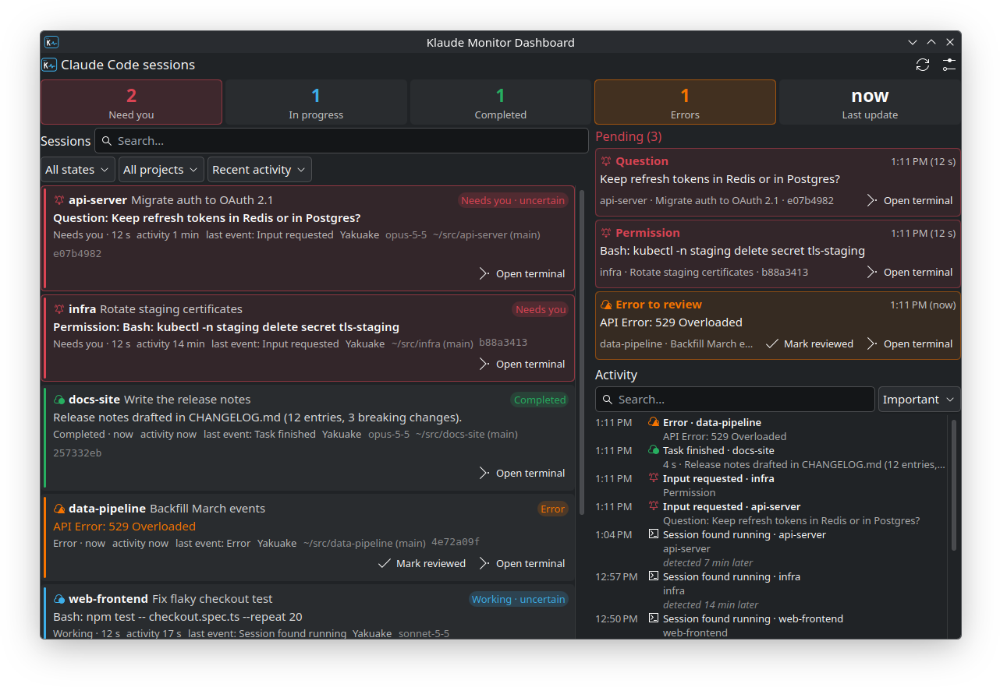

<p align="center">
  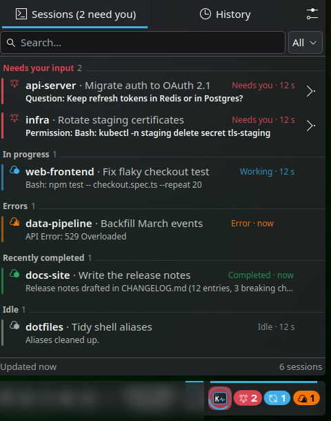
  &nbsp;
  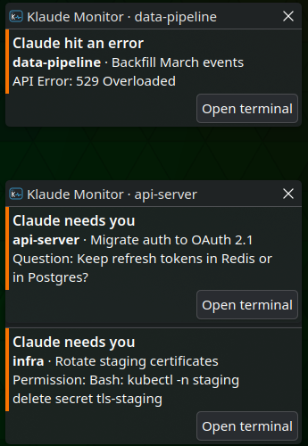
</p>

Klaude Monitor has two widgets that show the same data from one shared background service:

| | Panel widget | Desktop dashboard |
| --- | --- | --- |
| Purpose | Quick glance, always visible | Permanent monitoring board |
| Shows | Claude icon, **red badge with the sessions that need you**, tasks in progress, error dot | Counters, pending interventions, detailed session cards, activity history |
| Click | Popup with sessions grouped by priority, filter, history, settings | Cards with actions (open terminal, resume, mark reviewed) |

> Klaude Monitor is a community project. It is not made, endorsed or supported by Anthropic.
> "Claude" and "Claude Code" are trademarks of Anthropic.

## Features

- 🔔 **Know when you're needed.** Sessions waiting for a permission, an answer (`AskUserQuestion`) or a plan approval
  jump to the top, turn the panel icon red and send one desktop notification, showing **what** Claude is asking.
- ⚙️ **See what every session is doing.** Current tool (`Bash: npm test`, `Edit: src/app.ts`…), last result,
  Claude's own recap, the project, branch, model, terminal and how long it has been in its state.
- 🎯 **Jump to the terminal.** Click a session to focus the terminal it runs in: the exact **Yakuake** tab (unfolding
  Yakuake if it is retracted), the exact **Konsole** tab, the exact **kitty** tab/split, or any other terminal window.
  Ended sessions can be resumed (`claude --resume`) in your preferred terminal.
- 🧭 **Honest states.** Each session is in exactly one state, with a certainty level. A session whose process
  vanished without reporting an exit is shown as **unknown**, never as completed.
- 🕓 **Persistent history.** Session starts, resumes, tasks, interventions, confirmations and errors are stored with
  both the time they happened and the time the monitor detected them. Kept for a configurable period; survives
  restarts of the widgets, of Plasma and of the monitor itself.
- 👥 **Multiple accounts.** Sessions run with different `CLAUDE_CONFIG_DIR`s (e.g. personal and work) are detected
  automatically.
- 🌍 English and Spanish.

## How it works

```
 Claude Code ──► ~/.claude*/sessions/<pid>.json  (state files, written by Claude Code)
     │       ──► ~/.claude*/projects/…/<id>.jsonl (transcripts)
     │       ──► hooks ─► klaude-monitor-hook ─► ~/.local/state/klaude-monitor/spool/
     ▼
 klaude-monitord  (one per user; systemd user service + D-Bus activation)
   • watches the files above (inotify) and the processes (pidfd), re-checks every few seconds as a fallback
   • session state machine · SQLite history · desktop notifications · terminal integration
   • D-Bus: io.github.aqu1ntero.KlaudeMonitor
     ▲                         ▲
     │ long poll (D-Bus)       │ long poll (D-Bus)
 Panel widget            Desktop dashboard          (+ the klaude-monitor CLI)
```

**Why a separate service?** Two plasmoids do not share memory or state: each one has its own QML scene, and a
desktop widget can even run in another process. A monitor inside a widget would be duplicated (two watchers, two
histories, two notifications for the same event) and would die when that widget is removed. So the monitor is a
small Python daemon that both widgets talk to over the session D-Bus:

- **One source of truth.** The daemon owns the well-known bus name; a second instance exits immediately. Both
  widgets read the same state and the same history.
- **Push updates.** Each widget keeps a long-poll call (`WaitForUpdate`) open; the daemon answers it as soon as
  anything changes (≈30 ms in tests), so both widgets update together without polling.
- **Starts and recovers on its own.** It is enabled as a systemd user service (`Restart=on-failure`), and D-Bus
  activation starts it on demand if it is not running. Restarting it loses nothing: sessions and history are in
  SQLite, and hook events that arrive while it is stopped wait in a spool directory.
- **Independent of the widgets.** Removing, restarting or crashing a widget, or restarting Plasma, does not affect
  the daemon or the other widget.

See [docs/ARCHITECTURE.md](docs/ARCHITECTURE.md) for the state machine, data sources and the D-Bus API.

## Requirements

| Requirement | Why |
| --- | --- |
| KDE Plasma 6 (6.0+) | The widgets |
| Python 3.10+ with PyGObject (`gi`) | The daemon. Usually preinstalled on KDE; otherwise `python3-gi` (Debian/Ubuntu), `python-gobject` (Arch), `python3-gobject` (Fedora) |
| Claude Code 2.1+ | Writes the session state files the monitor reads |
| `msgfmt`, `zip` (build only) | Translations and `.plasmoid` packages |
| Yakuake, Konsole or kitty *(optional)* | Exact tab focusing |

No root access is needed: everything is installed for your user, under `~/.local`.

## Install

### From the KDE Store (simplest)

1. Right-click the panel or the desktop → **Add Widgets…** → **Get New Widgets…** → **Download New Plasma
   Widgets…**, search **Klaude Monitor** and install the panel widget, the dashboard, or both.
2. Add the widget. The first time, it explains what the background service is and exactly what installing it
   will change, and offers to install it with one button (optionally with the Claude Code hooks):

   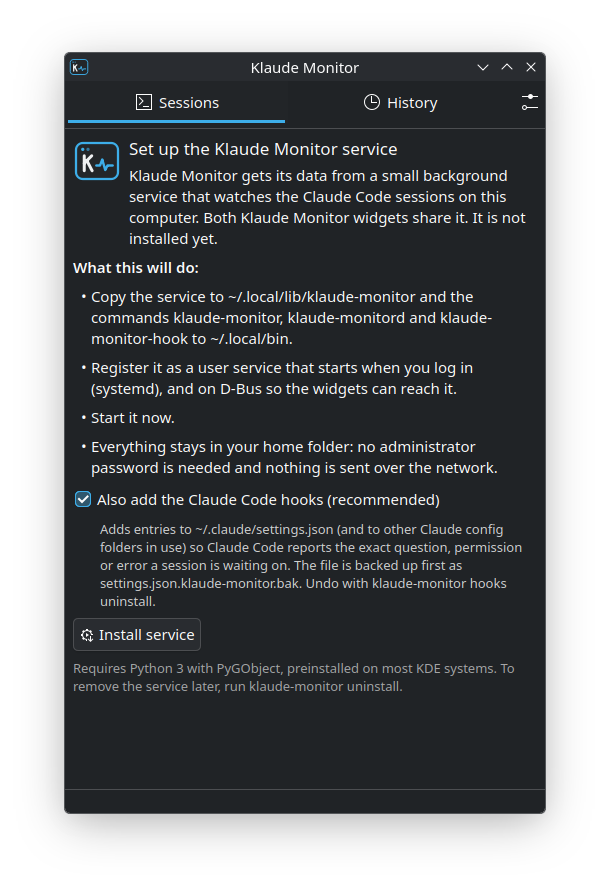

   The service is bundled inside each widget, so nothing else is downloaded. No administrator password is
   needed; everything goes into your home folder. If a widget update brings a newer service, the widget offers
   to update it the same way.

### From the source

```sh
git clone https://github.com/aqu1ntero/plasma-klaude-monitor
cd plasma-klaude-monitor
./install.sh all --hooks      # service + both widgets + Claude Code hooks
```

Or step by step:

```sh
./install.sh runtime          # the shared service (required by both widgets)
./install.sh hooks            # optional, recommended: exact questions, permissions and errors
./install.sh panel            # panel widget
./install.sh desktop          # desktop widget
./install.sh status
```

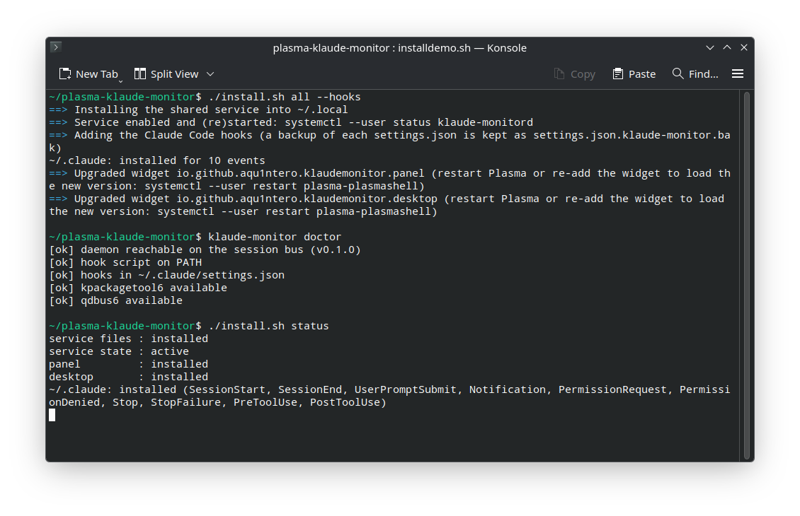

### Step by step

1. **Install** with one of the commands above. `klaude-monitor doctor` checks that the service answers and the
   hooks are in place.
2. **Add the widgets.** Right-click the panel or the desktop → **Add Widgets…** → search **Klaude**. Both widgets
   are listed:

   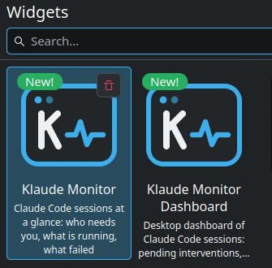

3. **Panel:** drag **Klaude Monitor** onto a panel (horizontal or vertical). The icon shows a red badge with the
   sessions that need you and a blue one with the tasks in progress:

   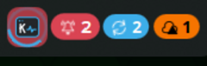

4. **Desktop:** drag **Klaude Monitor Dashboard** onto the desktop and resize it as you like:

   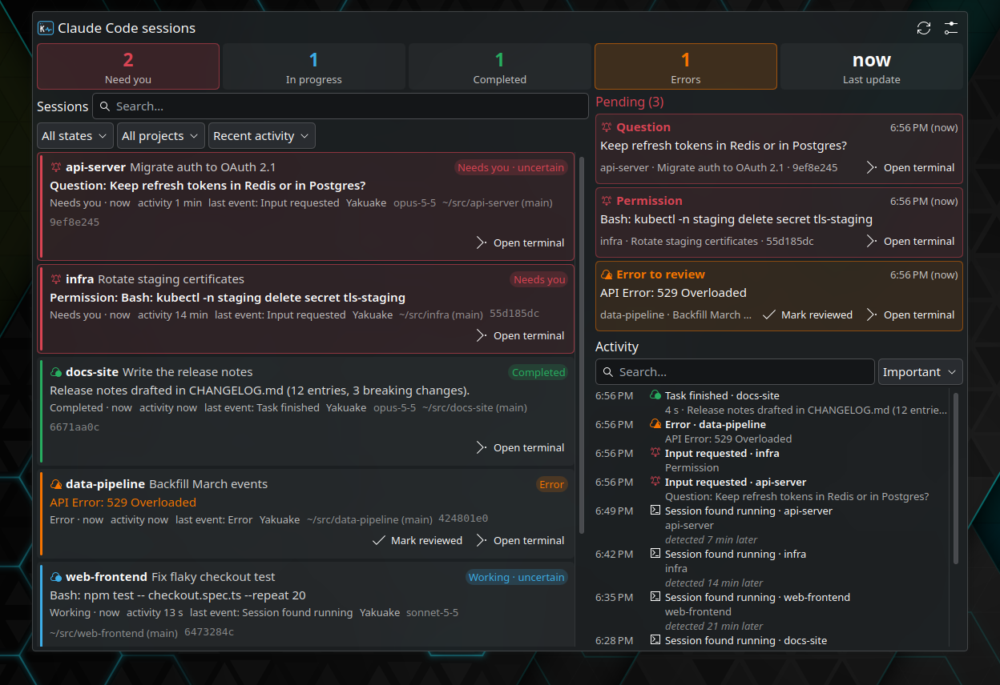

5. **Configure** (optional): right-click a widget → **Configure…**. See [Settings](#settings).

### Install, activate, remove

These are three different things:

| Component | Install | Activate | Remove |
| --- | --- | --- | --- |
| **Service** (`klaude-monitord`) | `./install.sh runtime`, or the **Install service** button in a widget | Automatic: enabled at login, also started on demand by D-Bus | `klaude-monitor uninstall` or `./install.sh uninstall-runtime` (stops it and removes the hooks; add `--purge` to delete history and settings) |
| **Hooks** | `./install.sh hooks` | Immediately, for new Claude Code events | `klaude-monitor hooks uninstall` |
| **Panel widget** | `./install.sh panel` | *Add Widgets…* → *Klaude Monitor* → drag to a panel | Remove it from the panel (only that instance), or `./install.sh uninstall-panel` (the package) |
| **Desktop widget** | `./install.sh desktop` | *Add Widgets…* → *Klaude Monitor Dashboard* → drag to the desktop | Remove it from the desktop, or `./install.sh uninstall-desktop` |

- You can install **only the panel widget** or **only the desktop widget**; each needs only the service.
- Removing a widget (from the panel or the system) **never stops the service**: the other widget keeps working.
- A widget installed without the service shows what the service is and an **Install service** button.
- After upgrading a widget that is already on screen, restart Plasma (`systemctl --user restart plasma-plasmashell`)
  or re-add the widget to load the new version. Your history is not affected.
- `./install.sh hooks` edits `settings.json` in every Claude config dir it knows about, keeps a backup next to it
  (`settings.json.klaude-monitor.bak`) and only touches its own entries; `hooks uninstall` removes exactly those.

## Using it

### Panel widget

<p>
  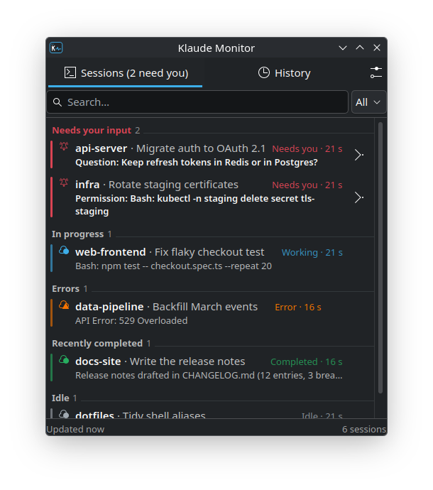
  &nbsp;
  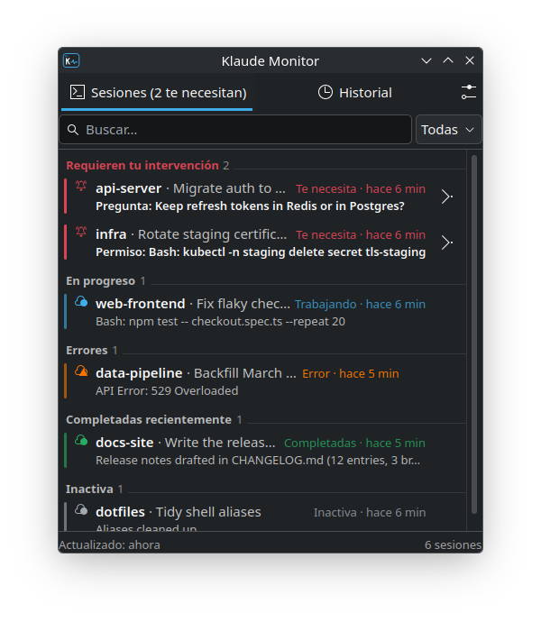
</p>

- **Red badge**: sessions that need you. **Blue badge**: tasks in progress. **Amber dot**: errors to review.
- The icon pulses when a session starts needing you and flashes green when a task finishes (configurable).
- **Click**: popup with the sessions grouped as *Needs your input*, *In progress*, *Errors*, *Recently completed*,
  *Unknown*, *Idle*. Each row shows the project, the task title, the state, for how long, and the question,
  tool, result or error.
- **Click a row** to focus its terminal; ended sessions offer **Resume** instead.
- **Middle click** on the icon jumps straight to the session that has waited longest.
- The popup has a search box, a state filter, a *History* tab and a settings button.

### Desktop dashboard

- **Counters** at the top: need you, in progress, completed recently, errors, and the time of the last update.
  Click a counter to filter by it.
- **Sessions**: detailed cards with project, task title, working directory and branch, session id, state and its
  certainty, time in state, last activity, last event, Claude's recap or your last prompt, the pending question,
  the final result or the error, the terminal, and actions. Filter by state, project and text; sort by recent
  activity, last change, project or state. Sessions waiting for you always stay on top.
- **Pending**: only what needs an action from you: the question or confirmation Claude is waiting for, the project
  and session, when it was asked, and a button to open the terminal, plus errors to review.
  Opening the terminal does **not** mark anything as resolved; only Claude Code's own state does.
- **Activity**: chronological history. Hover a time to see when it happened and when it was detected; events
  detected late are marked.
- Resizable: two columns when wide, tabs when narrow.

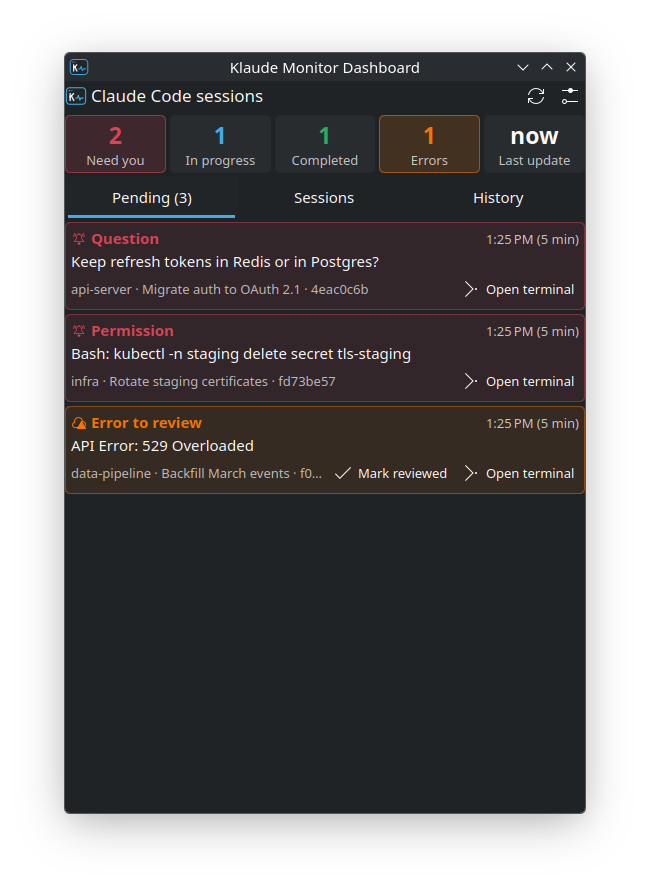

### Notifications

The service sends a single notification per event (never one per widget): when a session needs you, with the
question or the exact permission; when a task finishes (if it took longer than a threshold); and on errors.
**Open terminal** jumps to the session.


### Settings

Each widget has two pages:

- **Appearance** (per widget): density, visible sections, default filter and order, which sessions to show
  (completed, idle, ended), hidden projects, history length, panel icon effects.
- **Monitor** (shared): history retention, re-check interval when no events arrive, how long a task counts as
  recently completed, how long ended sessions stay listed, notifications, and the terminal used to resume sessions.
  These live in the service (`~/.config/klaude-monitor/config.json`), so changing them in one widget changes them for
  both.

<p>
  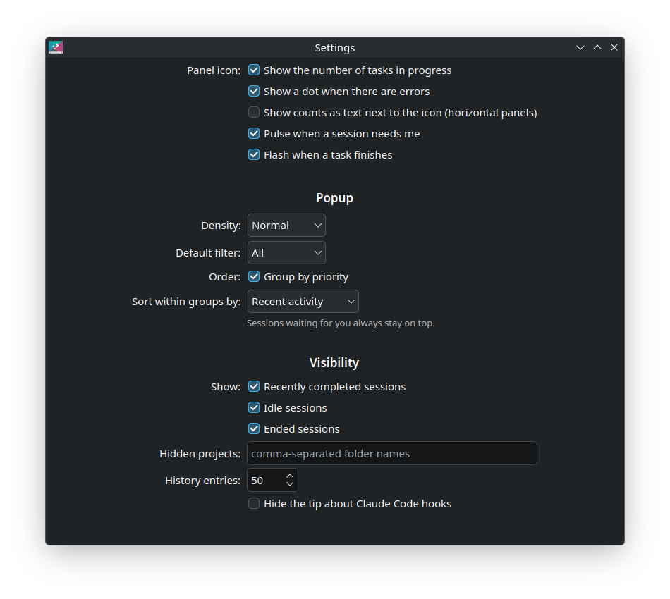
  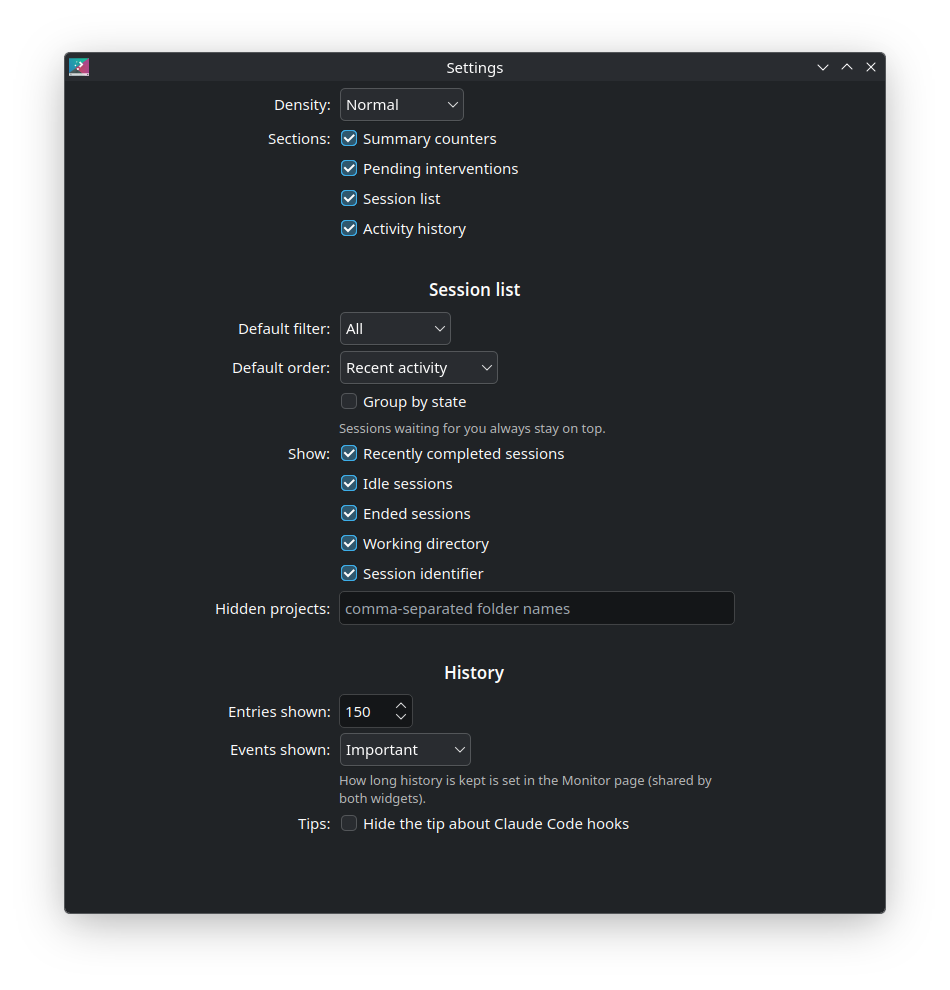
</p>

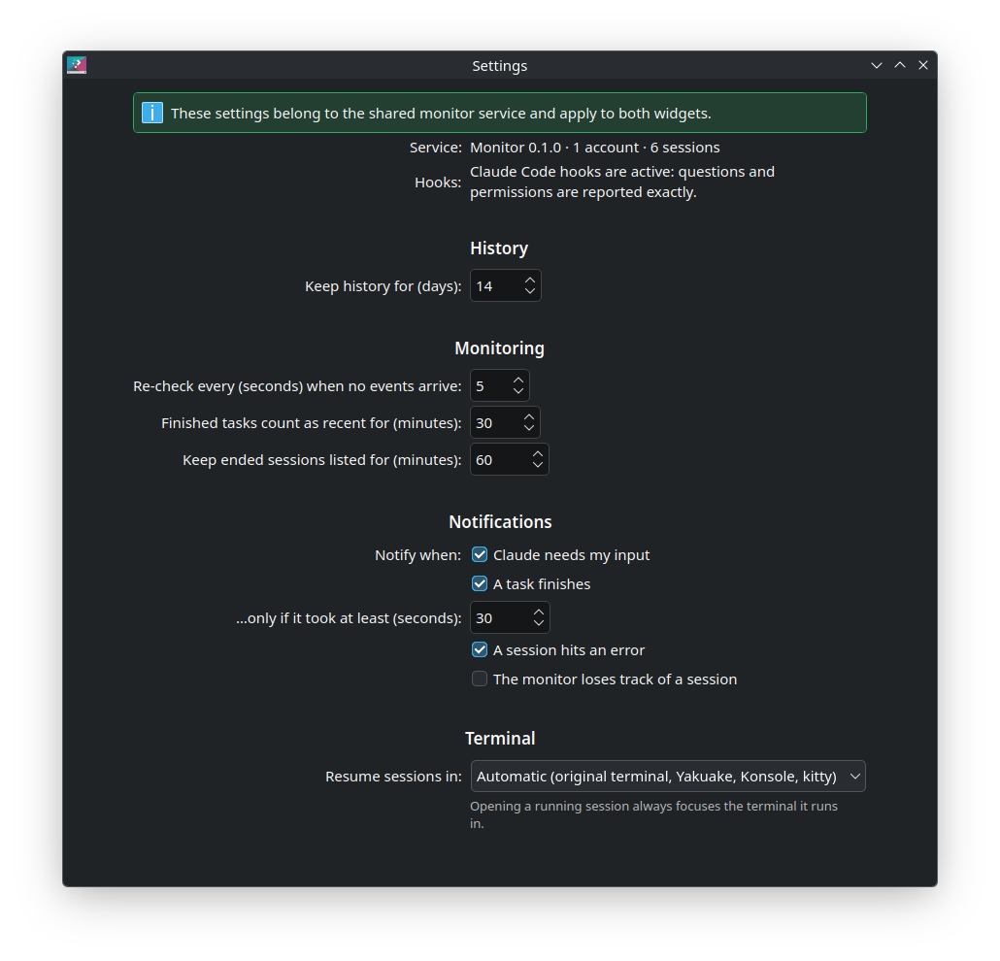

Both widgets follow the Plasma theme, colors and fonts.

### Command line

```sh
klaude-monitor status            # sessions and counters
klaude-monitor history -n 50     # recent events (+Ns = detected that much later)
klaude-monitor focus <project|id-prefix> [--resume]
klaude-monitor hooks install|uninstall|status [--config-dir DIR]
klaude-monitor config [key=value …]
klaude-monitor forget <id-prefix>
klaude-monitor doctor
klaude-monitor uninstall [--purge]   # remove the service and the hooks (and the history with --purge)
```

## Hooks: with and without

The monitor works without hooks, from the state files and transcripts Claude Code writes. The hooks make it
exact and faster:

| | Without hooks | With hooks |
| --- | --- | --- |
| Needs-you detection | Yes (state file) | Yes, immediately |
| What is being asked | Questions (`AskUserQuestion`) from the transcript; permissions only as *"Permission"* | The exact tool and command, e.g. `Bash: kubectl delete …` |
| Errors | API errors in the transcript | Also `StopFailure` (rate limits, auth…) |
| Session exit | Shown as **unknown** (it cannot tell a clean exit from a crash) | Shown as **ended** with the reason |
| Resumed sessions | Detected when the session id was seen before | Always (`SessionStart` with `source: resume`) |

The hook is a tiny `sh` script: it writes the event to a spool file and exits, never prints anything and always
exits 0, so it cannot block or change what Claude Code does.

## Terminals and limitations

Opening a session focuses the terminal it **already runs in**; the monitor never types into it.

| Terminal | What happens |
| --- | --- |
| **Yakuake** | Raises the exact tab and unfolds Yakuake if it is retracted |
| **Konsole** | Selects the exact tab and activates its window |
| **kitty** | Focuses the exact tab/split if remote control is enabled (`allow_remote_control socket-only` and `listen_on unix:@kitty-{kitty_pid}` in `kitty.conf`); otherwise activates the window |
| Others (Alacritty, WezTerm, foot, GNOME Terminal, Ghostty…) | Activates the terminal window (not a specific tab) |

Known limitations:

- **KWin only.** Window activation goes through a short-lived KWin script, because on Wayland only the compositor
  may activate another application's window. Other compositors: tab selection in Yakuake/Konsole/kitty still
  works, window activation does not.
- **Konsole with several windows** in one process: the right tab is selected, but if KWin cannot tell the windows
  apart, another window of the same Konsole may be raised.
- **tmux/screen/zellij**: the terminal hosting the multiplexer client is activated, not the pane.
- **Background sessions** (no terminal attached) and sessions running over **SSH** have no local terminal to focus.
- **Resume** opens a new tab/window running `claude --resume <id>` in the project folder; it is only offered for
  sessions that are no longer running.
- Without hooks, the monitor cannot tell a clean exit from a crash, so ended sessions show as *unknown* (on purpose:
  missing information is never reported as success).
- Events that happened while the monitor was stopped are recovered from the state files and the hook spool when it
  starts again; they are marked as detected late, and sessions found already running have *low* certainty until
  their next change.

## Development

```sh
python3 -m unittest discover -s daemon/tests   # state machine, transcript parser, hooks, config, hook script
tools/build.sh                                 # assemble build/<id>/ and build/<id>.plasmoid
tools/extract-messages.sh                      # refresh po/klaude-monitor.pot and po/*.po
tools/demo.py start|step|stop                  # fake sessions in every state (testing, screenshots)
plasmawindowed io.github.aqu1ntero.klaudemonitor.desktop   # run a widget in a window
```

Run the daemon from the source tree with `PYTHONPATH=daemon python3 -m klaude_monitord daemon` (stop the installed
one first: `systemctl --user stop klaude-monitord`). Logs: `journalctl --user -u klaude-monitord -f`.

The QML shared by both widgets lives in `shared/qml/` and is copied into each package by `tools/build.sh`.

## Publishing a release

1. Bump `__version__` in `daemon/klaude_monitord/__init__.py` and `"Version"` in both `plasmoids/*/metadata.json`.
2. `tools/build.sh` creates `build/io.github.aqu1ntero.klaudemonitor.panel.plasmoid` and
   `build/io.github.aqu1ntero.klaudemonitor.desktop.plasmoid`. Each one bundles the service (`contents/runtime`)
   and the translations.
3. Upload each `.plasmoid` to its product on [store.kde.org](https://store.kde.org) (Plasma 6 widgets), and attach
   them to the GitHub release.

The widgets compare the bundled service version with the running one and offer the update themselves.

## Credits

Klaude Monitor is based on [**Claude Sessions**](https://github.com/lfdominguez/noctalia-plugins/tree/main/claude-sessions),
the Noctalia bar plugin by **Luis Felipe Domínguez Vega** ([lfdominguez/noctalia-plugins](https://github.com/lfdominguez/noctalia-plugins),
MIT license), which pioneered reading Claude Code's session state files, parsing transcripts and focusing kitty
tabs. See [NOTICE](NOTICE).

## License

GPL-2.0-or-later. See [LICENSE](LICENSE).
